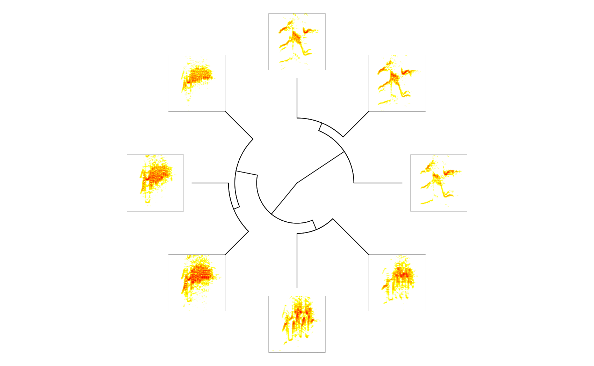

Cultural evolution in long-billed hermits
================

Creating long-billed hermit song cultural evolution trees and analyzing evolutionary patterns

<!-- README.md is generated from README.Rmd. Please edit that file -->

Table of contents
-----------------

-   [General info](#general-info)
-   [Analyses](#Analyses)
-   [To do list](#to-do-list)
-   [Contact](#contact)

General info
------------

Code used for creating long-billed hermit song cultural evolution trees and analyzing evolutionary patterns.

Analysis
--------

-   [Optimizing cost for MAFFT alignments](https://rpubs.com/marcelo-araya-salas/601010)
-   [Aligning song sequences with mafft and prank](https://rpubs.com/marcelo-araya-salas/601065)

In progress
-----------

-   Making trees with RevBayes
    -   [diagnostics matrix](https://rpubs.com/marcelo-araya-salas/623004)
    -   [diagnostic plots](lbh_cultural_evolution/tree/master/output/MCMC_diagnostic_plots)

To-do list
----------

-   Run revbayes posterior predictions (P3)
-   Summarize results

Status
------

Project is: *in progress*

Contact
-------

Created by [Marcelo Araya-Salas](https://marceloarayasalas.weebly.com/) - feel free to contact me!
